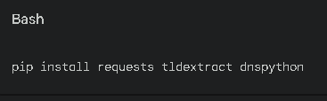
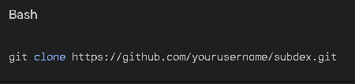
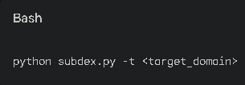
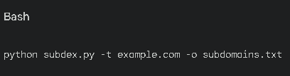

# SubDex---Domain-Enumerator-Tool
SubDex is a Python-based tool designed to efficiently enumerate subdomains of a given domain. It leverages a combination of techniques, including brute-force, DNS queries, and online resources, to discover potential subdomains.

Key Features:
-Brute-force enumeration: Uses a customizable wordlist to generate and test potential subdomains.
-DNS queries: Leverages DNS queries to verify the existence of discovered subdomains.
-Online resources: Exploits online services like Google Search and Censys to uncover hidden subdomains.
-Customizable output: Allows you to tailor the output format to your preferences.
-Efficient processing: Optimizes performance through parallel processing and caching.

Usage:

1. Install dependencies:
   

3. Clone the repository:
   

5. Run the tool:
   

Options:

-t: Specifies the target domain.
-w: Provides a custom wordlist file.
-o: Specifies the output file.
-v: Enables verbose output.

Example:

Contributing:
Contributions are welcome! Please feel free to submit bug reports, feature requests, or pull requests.

License:   
SubDex is released under the MIT License.

Acknowledgements:
The tool incorporates ideas and techniques from existing subdomain enumeration tools.
Special thanks to the contributors for their valuable contributions.
